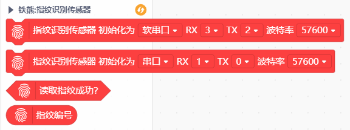

# 指纹识别传感器 Mind+ 用户库

## 简介

本扩展库为指纹识别传感器设计，支持录入指纹与识别指纹等功能。

支持 Mind+ 导入库，**要求 Mind+ 软件版本为 1.6.2 及以上**。

## 链接

- **本用户库加载地址：**

  GitHub：[https://github.com/chenzhongxian/ext-fingerprint](https://github.com/chenzhongxian/ext-fingerprint)

  或：码云（推荐国内用户使用）：[https://gitee.com/ironpanda/ext-fingerprint](https://gitee.com/ironpanda/ext-fingerprint) 

- **Mind+ 软件下载地址：**[http://mindplus.cc](http://mindplus.cc)

- **指纹传感器 Arduino 库地址：**https://github.com/adafruit/Adafruit-Fingerprint-Sensor-Library

- **产品购买推荐链接**：https://www.dfrobot.com.cn/goods-1172.html

## Blocks

Mind+ 模块：

## 示例程序

指纹识别示例：

## License

MIT

## 硬件支持

MCU                | JavaScript    | Arduino   | MicroPython    | Remarks
:----------------: | :----------: | :----------: | :---------: | :---:
micro:bit        |             |       √       |             | 
mPython（掌控版）        |             |        √      |             | 
Arduino Uno    |             |        √      |             | 
Arduino Leonardo | | √ | | 
Arduino Mega2560 | | √ | | 

## 更新日志

- V0.1.0 20200324 Alpha版发布

